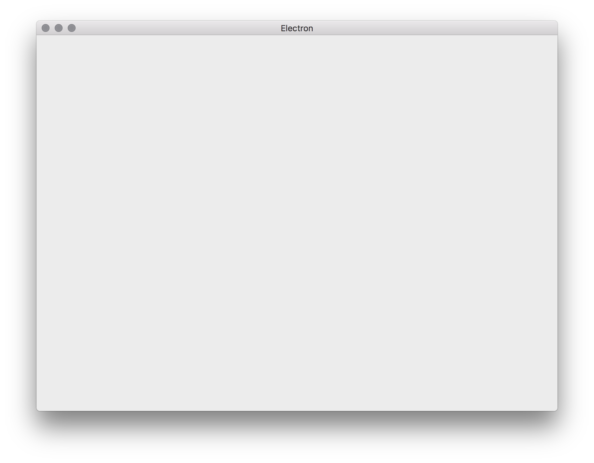

# Firesale

A tutorial on building a Markdown renderer in Electron.

## Getting Started and Acclimated

Clone this repository and install the dependencies using `npm install`.

We'll be working with four files for the duration of this tutorial:

- `lib/main.js`, which will contain code for the main process
- `lib/renderer.js`, which will code for the renderer process
- `lib/index.html`, which will contain the HTML for the user interface
- `lib/style.css`, which will contain the CSS to style the user interface

In a more robust application, you might break stuff into smaller files, but we're not going to for the sake of simplicity.

## Hello World

Now that we have our dependencies and some basic files. Let's get our Electron application to the point where we can launch it.

Everything in Electron lives inside of the `electron` library. Let's start by requiring it inside of `main.js`.

```js
const electron = require('electron');
```

Electron contains many [modules][] that we'll use for building our application. The first—and arguably, most important—that we're going to need is the `app` module. All modules exist as properties on the `electron` object. We're going to be using the `app` module pretty often, so let's store it in its own variable.

[modules]: http://electron.atom.io/docs/v0.36.5/#modules-for-the-main-process

```js
const electron = require('electron');
const app = electron.app;
```

The [`app`][app] module has a number of life-cycle events. Here are a few examples:

[app]: http://electron.atom.io/docs/v0.36.5/api/app/

- `ready`
- `quit`
- `before-quit`
- `will-quit`
- `window-all-closed`

Right now, displaying a user interface when the application is `ready` is our primary concern. So, we'll listen for the `ready` event.

```js
const electron = require('electron');
const app = electron.app;

app.on('ready', function () {
  console.log('The application is ready.');
});
```

There isn't much to look at yet, but if we run `electron .`, you should notice the following.

1. Our message is logged to the console.
1. An Electron icon pops up in the Dock.

Hit `Control-C` to kill the application.

### Firing Up a Renderer Process

Now, that we can spin up our application, it's time to go ahead and build a user interface. In order to create a window for our application, we'll need to pull in the `BrowserWindow` module.

```js
const BrowserWindow = electron.BrowserWindow;
```

We'll create the main window for our application when the application is ready. That said, we need declare a variable to store our main window in the top level scope. This is due to the combination of two facts:

1. JavaScript has function scopes.
1. Our `ready` even listener is a function.

If we declared `mainWindow` variable in our event listener, it would be eligible for garbage collection as soon as that function is done executing, which is bad news.

To avoid this, we'll update `main.js` as follows:

```js
const electron = require('electron');
const app = electron.app;
const BrowserWindow = electron.BrowserWindow;

var mainWindow = null;

app.on('ready', function () {
  console.log('The application is ready.');

  mainWindow = new BrowserWindow();

  mainWindow.on('closed', function() {
    mainWindow = null;
  });
});
```

If the user ever closes the window, we'll set the `mainWindow` back to `null`.

Let's take our application for a spin again by running `electron .` from the command line. You should see something resembling the image below.



Let's actually load some content, shall we?

```js
app.on('ready', function () {
  console.log('The application is ready.');

  mainWindow = new BrowserWindow();

  mainWindow.loadURL('file://' + __dirname + '/index.html');

  mainWindow.on('closed', function() {
    mainWindow = null;
  });
});
```


